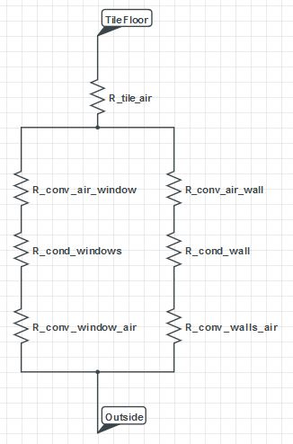
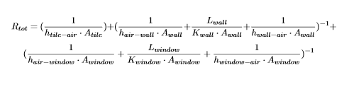
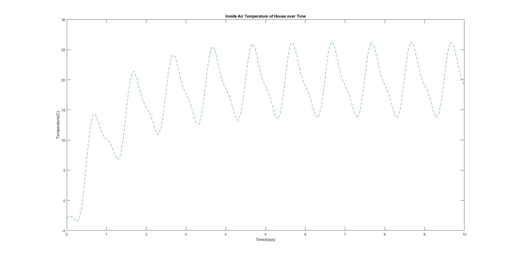

# Warmup Project
## Jonas Kazlauskas | Sam Kaplan
### Quantatative Engineering Analysis 2 | Fall 2020

This is the first project of QEA2 at Olin College of Engineering.

In order to solidify our understanding of differential equations and heat transfer, we are designing a passive solar house for Vermont. A passive solar house combines interior features, exterior landscaping, and architectural design choices to ultimately heat the house with minimal electricity and fossil fuels. 

The basic principles of a passive solar house are an aperture (window) to let solar radiation in, an aborber and thermal mass to absord and store the heat from the sun, and some components of heat transfer to evenly distribute the heat throughout the house. Additionally, there are often some control elements to adjust the amount of solar radiation coming in throughout the changing seasons, and thermal insulation can be useful to retain heat in colder climates.

For our house, we plan on starting with a simple house design to get a feel for how heat moves throughout the building. We plan on utilizing a south facing window with an overhang roof to let the sun in when we need it during the winter and block it out during the summer when it is naturally warmer. This is because in the northeast the sun takes a lower southern path during the winter, and a higher path during the summer. To absorb and store all of this solar radiation, we plan on and using a large slab of tile as our floor. Additionally, Vermont can get quite cold during the winter, so we will be insulating all of our walls and our floor. 

Some sections for the future:

* [Minimum Viable Project](#teleoperation)
* [Some Math (and MATLAB)](#math-and-matlab)
* [Moonshot](#driving-in-a-Square)
* [Lessons Learned](#following-a-Wall)

# Minimum Viable Project
Ideal orientation is true north but orientations of up to 20° west of north and 30° east of north still allow good passive sun control

Some assumptions that we make with our model are:
- The house is on stilts and therefore the heat loss from all sides of the house are equal
- Heat capacity of our tile floor is much greater than the rest of the house, therefore we can ignore the rest.
- Our tile floor is suspended above our insulation (no conduction of heat)
- Air flow in and out of the house is negligible
- All solar radiation hitting the windows is absorbed by heat storage unit, and solar radiation on other parts of the house is negligible
-  Heat storage unit is at a spatially uniform temperature

## Some Math (and MATLAB)

## Heat Transfer Equations
ODE for temperature inside the house:
  
where  
 
This equation tells us that given a set of house material properties, sizes, and solar radiation we can determine the temperature over time of the house. Some major assumptions are that solar radiation and the outside temperature are constant. 

## Our Model

As you can see, the overall behavior of our model is pretty reasonable. The first obvious problem, howevever is our range of equilibrium temperatures. As given by the assignment, the most comfortable temperature range to exist in is approximately 17&deg;C - 23&deg;C. Our model stablizes between 15&deg;C - 25&deg;C, which while small, is noticable. 

One change we could make to decrease the variability of our house temperature throughout the day is to increase the size of our thermal mass, or change it to a material with a higher heat capacity.

Our model is predicting fairly reasonable temperatures, however it has a large range of temperatures throughout the day, which might be annoying living in the house. Next steps are too hone in the size or material of our thermal mass to decrease this variabillity. Additionally, 

Our model is also somewhat *simple* and we can probably reduce our thermal range by making better assumptions or incorporating additional factors. 
## Lessons Learned

